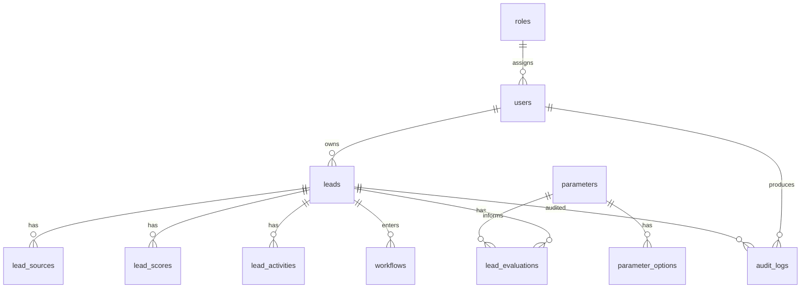

# Database Schema

## Schema Status
This document defines the target normalized schema for the enterprise qualification layer and maps it to the current repository state.

## Current Tables Already Present
- `users`
- `roles` and permission tables
- `leads`
- `lead_sources`
- `lead_contacts`
- `lead_scores`
- `lead_qualifications`
- `lead_activities`
- `audit_logs`
- funnel and revenue-intelligence supporting tables

## Target Enterprise Entities
Required entities from the directive:
- `users`
- `roles`
- `leads`
- `lead_sources`
- `parameters`
- `parameter_options`
- `lead_scores`
- `lead_evaluations`
- `lead_activities`
- `workflows`
- `audit_logs`

## Alignment Strategy
- Reuse existing lead-centric tables where they already satisfy the requirement.
- Extend `lead_qualifications` and `lead_scores` for explainability rather than duplicating logic immediately.
- Introduce DB-backed parameter and workflow tables as the governed Phase 2 foundation.

## Target ERD

## Current-to-Target Mapping
| Target entity | Current state |
| --- | --- |
| `users` | implemented |
| `roles` | implemented |
| `leads` | implemented |
| `lead_sources` | implemented |
| `parameters` | implemented via `qualification_parameters` |
| `parameter_options` | implemented via `qualification_parameter_options` |
| `lead_scores` | implemented |
| `lead_evaluations` | partially represented by `lead_qualifications` plus score breakdowns |
| `lead_activities` | implemented |
| `workflows` | implemented via `qualification_workflows`, `qualification_workflow_stages`, `qualification_workflow_reviews` |
| `audit_logs` | implemented |

## Enterprise Qualification Persistence
Current persisted qualification result should include:
- top-level classification
- score
- recommendation
- risk flags
- hard-stop list
- dimension breakdown
- evaluation snapshot

This batch adds those fields to `lead_qualifications` so explainable outputs can be stored without introducing duplicate tables prematurely.

## Multi-Tenant Readiness
Phase 3 foundation now includes:
- `tenants` table
- nullable `tenant_id` on core users, leads, audit logs, qualification policy, and workflow tables
- default-tenant backfill for existing records
- extended `tenant_id` coverage on `products`, `territories`, `icp_profiles`, `integration_configs`, and `revenue_rules`
- tenant-safe uniqueness for active qualification parameter sets, active qualification workflows by trigger, and integration config keys

Still deferred:
- enforced tenant scoping in all queries
- tenant-aware auth/session isolation

## Schema Hardening Layer
The current production schema now includes additional integrity controls intended to keep future changes consistent:
- `record_origin_mappings` preserves lineage between imported legacy records and current records
- one primary contact per lead enforced at the database layer
- one source identity per lead enforced at the database layer
- one active qualification parameter set per tenant enforced at the database layer
- one active qualification workflow per tenant and trigger status enforced at the database layer
- operational indexes for lead filtering and latest score / qualification lookups

## Soft Delete Strategy
- `leads` already support soft deletes
- `qualification_parameter_sets`, `qualification_workflows`, and `tenants` now support soft delete

## Migration Direction
Implemented now:
- extend `lead_qualifications` for enterprise explainability
- `qualification_parameter_sets`
- `qualification_parameters`
- `qualification_parameter_options`
- `qualification_workflows`
- `qualification_workflow_stages`
- `qualification_workflow_reviews`
- `tenants`
- `tenant_id` links on core qualification-ready entities
- `tenant_id` links on core configuration/master-data entities
- `record_origin_mappings`
- production-grade uniqueness and operational indexes for lead, workflow, and config integrity

Planned next:
- admin UI for policy/workflow management
- tenant scoping
- override approval analytics
