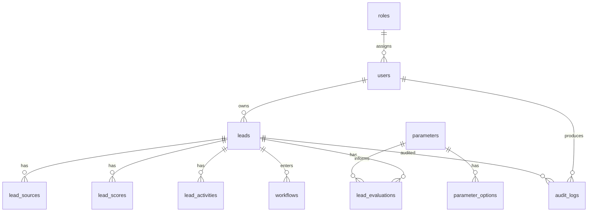

# Database Schema

## Schema Status
This document defines the target normalized schema for the enterprise qualification layer and maps it to the current repository state.

## Current Tables Already Present

### Core
- `users`
- `roles` and permission tables
- `leads`
- `lead_sources`
- `lead_contacts`
- `lead_scores`
- `lead_qualifications`
- `lead_activities`
- `audit_logs`

### Funnel & Revenue
- `funnel_stages`
- `lead_funnel_history`
- `revenue_rules`
- `lead_revenue_analyses`

### Products & ICP
- `products`
- `lead_product_matches`
- `lead_product_match_runs` _(added Phase 14)_
- `icp_profiles`
- `lead_icp_matches`

### AI Infrastructure
- `ai_providers`
- `ai_models`
- `ai_feature_routes`
- `ai_prompt_templates`
- `ai_prompt_template_versions`
- `ai_requests`
- `ai_connection_tests`

### Activities, Meetings & Intelligence
- `lead_meetings`
- `lead_transcripts`
- `lead_ai_evaluations`
- `lead_ai_analyses`
- `lead_follow_ups`

### Maps & Discovery
- `discovery_categories` _(added Phase 12)_
- `map_search_history`
- `map_candidates`
- `geo_product_fit_analyses` _(added Phase 16)_ — caches product-fit scores per (place_id, product_id) pair; keyed by payload hashes for cache invalidation

### Integration & Multi-Tenant
- `integration_configs`
- `tenants`
- `record_origin_mappings`

### WhatsApp
- `whatsapp_sessions`
- `whatsapp_conversations`
- `whatsapp_messages`

### Qualification Workflow
- `qualification_parameter_sets`
- `qualification_parameters`
- `qualification_parameter_options`
- `qualification_workflows`
- `qualification_workflow_stages`
- `qualification_workflow_reviews`

## Target Enterprise Entities
Required entities from the directive:
- `users`
- `roles`
- `leads`
- `lead_sources`
- `parameters`
- `parameter_options`
- `lead_scores`
- `lead_evaluations`
- `lead_activities`
- `workflows`
- `audit_logs`

## Alignment Strategy
- Reuse existing lead-centric tables where they already satisfy the requirement.
- Extend `lead_qualifications` and `lead_scores` for explainability rather than duplicating logic immediately.
- Introduce DB-backed parameter and workflow tables as the governed Phase 2 foundation.

## Target ERD

## Current-to-Target Mapping
| Target entity | Current state |
| --- | --- |
| `users` | implemented |
| `roles` | implemented |
| `leads` | implemented |
| `lead_sources` | implemented |
| `parameters` | implemented via `qualification_parameters` |
| `parameter_options` | implemented via `qualification_parameter_options` |
| `lead_scores` | implemented |
| `lead_evaluations` | partially represented by `lead_qualifications` plus score breakdowns |
| `lead_activities` | implemented |
| `workflows` | implemented via `qualification_workflows`, `qualification_workflow_stages`, `qualification_workflow_reviews` |
| `audit_logs` | implemented |

## Enterprise Qualification Persistence
Current persisted qualification result should include:
- top-level classification
- score
- recommendation
- risk flags
- hard-stop list
- dimension breakdown
- evaluation snapshot

This batch adds those fields to `lead_qualifications` so explainable outputs can be stored without introducing duplicate tables prematurely.

## Multi-Tenant Readiness
Phase 3 foundation now includes:
- `tenants` table
- nullable `tenant_id` on core users, leads, audit logs, qualification policy, and workflow tables
- default-tenant backfill for existing records
- extended `tenant_id` coverage on `products`, `territories`, `icp_profiles`, `integration_configs`, and `revenue_rules`
- tenant-safe uniqueness for active qualification parameter sets, active qualification workflows by trigger, and integration config keys

Still deferred:
- enforced tenant scoping in all queries
- tenant-aware auth/session isolation

## Schema Hardening Layer
The current production schema now includes additional integrity controls intended to keep future changes consistent:
- `record_origin_mappings` preserves lineage between imported legacy records and current records
- one primary contact per lead enforced at the database layer
- one source identity per lead enforced at the database layer
- one active qualification parameter set per tenant enforced at the database layer
- one active qualification workflow per tenant and trigger status enforced at the database layer
- operational indexes for lead filtering and latest score / qualification lookups

## Soft Delete Strategy
- `leads` already support soft deletes
- `qualification_parameter_sets`, `qualification_workflows`, and `tenants` now support soft delete

## Migration Direction
Implemented now:
- extend `lead_qualifications` for enterprise explainability
- `qualification_parameter_sets`
- `qualification_parameters`
- `qualification_parameter_options`
- `qualification_workflows`
- `qualification_workflow_stages`
- `qualification_workflow_reviews`
- `tenants`
- `tenant_id` links on core qualification-ready entities
- `tenant_id` links on core configuration/master-data entities
- `record_origin_mappings`
- production-grade uniqueness and operational indexes for lead, workflow, and config integrity

Planned next:
- admin UI for policy/workflow management
- tenant scoping
- override approval analytics

---

## Schema Changes — Phase 11–15 (2026-04-25)

### Phase 12: `discovery_categories` (new table)
Stores Google Places search category options — replaces hardcoded frontend dropdown.

| Column | Type | Notes |
|--------|------|-------|
| `id` | bigint PK | auto-increment |
| `label` | varchar | Display name, e.g. "Restaurant / F&B" |
| `value` | varchar UNIQUE | Google Places type, e.g. "restaurant" |
| `sort_order` | smallint | Controls dropdown order |
| `is_active` | boolean | Filters inactive categories from dropdown |
| `created_at`, `updated_at` | timestamp | |

Seeded with 14 default categories via `DatabaseSeeder::seedDiscoveryCategories()`.

---

### Phase 13: `lead_activities` — added columns

| Column | Type | Notes |
|--------|------|-------|
| `outcome` | varchar(1000) nullable | Free-text outcome of the activity |
| `activity_date_override` | timestamp nullable | Explicit activity date set by user |
| `next_follow_up_date` | date nullable | Suggested follow-up date surfaced in progress summary |

---

### Phase 14: `products` — added columns

| Column | Type | Notes |
|--------|------|-------|
| `supported_regions` | varchar(500) nullable | Geographic regions the product serves |
| `budget_range` | varchar(255) nullable | Expected budget range, e.g. "IDR 50M–200M/year" |
| `target_company_size` | varchar(255) nullable | Preferred company size range |
| `use_cases` | json nullable | Array of use-case strings |
| `competitor_notes` | text nullable | Known competitors and differentiators |
| `keywords` | json nullable | Array of matching keywords |

### Phase 14: `lead_product_matches` — added columns

| Column | Type | Notes |
|--------|------|-------|
| `bant_analysis` | json nullable | `{budget, authority, need, timeline, competitor}` each with `score` (0–100) and `reasoning` |
| `reasoning` | json nullable | Array of human-readable reasoning strings |
| `recommended_approach` | text nullable | AI-generated sales approach for this lead-product pair |
| `competitor_context` | varchar(1000) nullable | Identified competitors and differentiation notes |
| `match_level` | varchar(20) nullable | `strong` \| `moderate` \| `weak` |
| `confidence_score` | smallint nullable | AI confidence 0–100 |
| `ai_provider_used` | varchar(100) nullable | Provider slug used for this match |
| `ai_model_used` | varchar(150) nullable | Model name used for this match |

### Phase 14: `lead_product_match_runs` (new table)
Audit trail for each time product matching is triggered for a lead.

| Column | Type | Notes |
|--------|------|-------|
| `id` | bigint PK | |
| `lead_id` | FK → `leads` | cascadeOnDelete |
| `triggered_by` | FK → `users` nullable | nullOnDelete |
| `products_evaluated` | smallint | How many products were scored |
| `matches_created` | smallint | How many match records were created/updated |
| `ai_calls_made` | smallint | Number of AI API calls made |
| `total_cost_usd` | decimal(10,6) nullable | Total AI cost for this run |
| `duration_ms` | int nullable | Wall-clock duration |
| `status` | varchar(20) | `completed` \| `failed` |
| `error_message` | text nullable | Set on failure |
| `run_at` | timestamp | Default = now() |
| `created_at`, `updated_at` | timestamp | |

Indexes: `lead_id`, `run_at`

---

## DB-Backed Reference Data (Seeded)

| Table | Seed Count | Notes |
|-------|-----------|-------|
| `industries` | 10 | + 42 sub-industries |
| `products` | 3 | Sample products — extend in Settings → Products |
| `funnel_stages` | 4–6 | Default pipeline stages |
| `ai_providers` | 3+ | Inactive by default — configure key in Settings → AI Defaults |
| `ai_models` | 7+ | GPT-5.4 (id:12) is default route for all features |
| `ai_feature_routes` | 13 | All features routed to GPT-5.4 as of 2026-04-25 |
| `discovery_categories` | 14 | Google Places categories for Maps Discovery |
| `icp_profiles` | 0 | Created by user or via AI generation |
